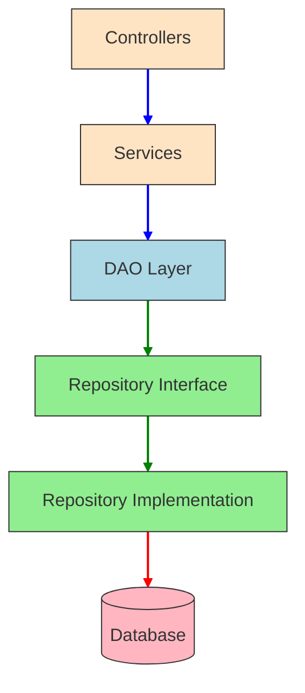

```mermaid
graph TD
    A[Controllers] --> B[Services]
    B --> C[DAO Layer]
    C --> D[Repository Interface]
    D --> E[Repository Implementation]
    E --> F[(Database)]
    
    style A fill:#ffe4c4,stroke:#333
    style B fill:#ffe4c4,stroke:#333
    style C fill:#add8e6,stroke:#333
    style D fill:#90ee90,stroke:#333
    style E fill:#90ee90,stroke:#333
    style F fill:#ffb6c1,stroke:#333
    
    linkStyle 0 stroke:#0000ff,stroke-width:2px
    linkStyle 1 stroke:#0000ff,stroke-width:2px
    linkStyle 2 stroke:#008000,stroke-width:2px
    linkStyle 3 stroke:#008000,stroke-width:2px
    linkStyle 4 stroke:#ff0000,stroke-width:2px
```