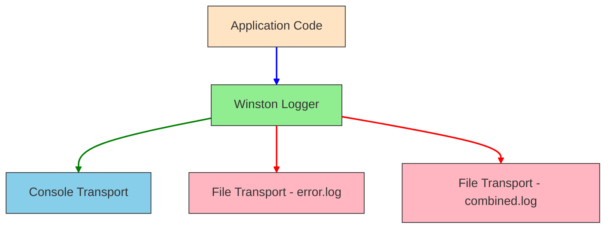

```mermaid
graph TD
    A[Application Code] --> B[Winston Logger]
    B --> C[Console Transport]
    B --> D[File Transport - error.log]
    B --> E[File Transport - combined.log]
    
    style A fill:#ffe4c4,stroke:#333
    style B fill:#90ee90,stroke:#333
    style C fill:#87ceeb,stroke:#333
    style D fill:#ffb6c1,stroke:#333
    style E fill:#ffb6c1,stroke:#333
    
    linkStyle 0 stroke:#0000ff,stroke-width:2px
    linkStyle 1 stroke:#008000,stroke-width:2px
    linkStyle 2 stroke:#ff0000,stroke-width:2px
    linkStyle 3 stroke:#ff0000,stroke-width:2px
```